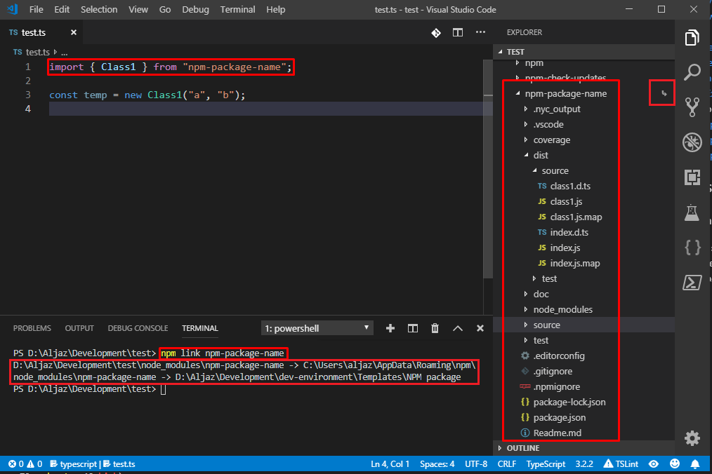

# NPM package template

This template will help you getting started quickly with developing a new NPM package with enforcing coding styles, unit tests with code coverage and instructions for deploying the package.

| Development platform | IDE                | Framework | Programming language | Coding standards | Testing     | Code coverage |
| -------------------- | ------------------ | --------- | -------------------- | ---------------- | ----------- | ------------- |
| Microsoft Windows 10 | Visual Studio Code | Node.js   | TypeScript           | TSLint           | Mocha, Chai | Istanbul      |

## Prerequisites

For using this template you'll need:

* Microsoft Windows 10,
* Microsoft Visual Studio Code.

Suggested Visual Studio Code extensions:

* [Code Spell Checker](https://marketplace.visualstudio.com/items?itemName=streetsidesoftware.code-spell-checker) for spell checking your source code,
* [Document This](https://marketplace.visualstudio.com/items?itemName=joelday.docthis) for easily generating code documentation,
* [EditorConfig for VS Code](https://marketplace.visualstudio.com/items?itemName=EditorConfig.EditorConfig) for enforcing code editor configurations,
* [Latest TypeScript and Javascript Grammar](https://marketplace.visualstudio.com/items?itemName=ms-vscode.typescript-javascript-grammar) for latest TypeScript support,
* [Markdown All in One](https://marketplace.visualstudio.com/items?itemName=yzhang.markdown-all-in-one) for easily writing Markdown files,
* [npm](https://marketplace.visualstudio.com/items?itemName=eg2.vscode-npm-script) for npm support vor VS Code,
* [npm Intellisense](https://marketplace.visualstudio.com/items?itemName=christian-kohler.npm-intellisense) for npm intellisense support,
* [Path Intellisense](https://marketplace.visualstudio.com/items?itemName=christian-kohler.path-intellisense) for local file system path intellisense support,
* [PowerShell](https://marketplace.visualstudio.com/items?itemName=ms-vscode.PowerShell) for VS Code and Powershell integration support,
* [Toggle Excluded Files](https://marketplace.visualstudio.com/items?itemName=eamodio.toggle-excluded-files) for easily toggling between showing all files / hiding hidden files defined in settings.json,
* [TSLint](https://marketplace.visualstudio.com/items?itemName=eg2.tslint) for enforcing TypeScript code style,
* [TypeScript Class Organizer](https://marketplace.visualstudio.com/items?itemName=aljazsim.tsco) for easily organizing TypeScript code,
* [TypeScript Code Explorer](https://marketplace.visualstudio.com/items?itemName=aljazsim.tsce) for easily navigating TypeScript code,
* [TypeScript Hero](https://marketplace.visualstudio.com/items?itemName=rbbit.typescript-hero) for easily dealing with code imports.

## How to use this template

### Setting up the environment

* create a source control repository,
* clone the repository locally,
* download the contents of this directory only (by downloading a ZIP archive from GitHub) to the root directory of your repository,
* update project information in [package.json](./package.json),
* update project dependencies in [package.json](./package.json),
* update existing NPM references by running `npm run update` in the VS Code terminal,
* install NPM packages by running `npm install` in the VS Code terminal,
* remove sample code in [./Source](./Source) and [./Test](./Test) directories,
* remove contents of the [./Doc](./Doc) directory,
* replace package logo in [./Doc/icon.png](./Doc/icon.png),
* replace the contents of this file with your project description.

### Setting editor, code styling and code transpiling preferences

* you can change your VS Code preferences in [.vscode](.vscode),
  * [./.vscode/settings.json](./.vscode/settings.json):
    * which files are hidden in VS Code by default,
    * which files are not being searched by default,
  * [./.vscode/launch.json](./.vscode/launc.json):
    * debugging commands,
  * [./.vscode/tasks.json](./.vscode/tasks.json):
    * project commands for building, testing and linting,
* you can change your text preferences in [.editorconfig](.editorconfig),
* you can change TSLint code styling preferences in [tslint.json](tslint.json),
* you can change TypeScript code transpiling preferences in [tsconfig.json](tsconfig.json).

### Project structure

By default:

* the VS Code Settings: [./vscode](./vscode),
* the package source: [./source](./source),
* the package unit test: [./test](./test),
* the package build artifacts: [./dist](./dist) (excluded from source control),
* the npm modules: [./node_modules](./node_modules) (excluded from source control),
* the package test coverage  [./coverage](./coverage) and [./nyc_output](./nyc_output) (excluded from source control),

If yo want to change your directory structure, be sure to update references in:

* [./tsconfig.json](./tsconfig.json) (build output directory),
* [./package.json](./package.json) (config file locations).

### Updating NPM package references

You can update all NPM package references in [package.json](./package.json) by:

* running command `npm run update` in the VS Code terminal.

### Building your project

You can build your project by:

* running command `npm run build` in the VS Code terminal or
* using shortcut `Ctr + Shift + B` (if you've installed the keybindings, see Tips and tricks).

### Enforcing code style

You can check if your code conforms to code style rules defined in [tslint.json](./tslint.json):

* running command `npm run lint` in the VS Code terminal or
* using shortcut `Ctr + Shift + L` (if you've installed the keybindings, see Tips and tricks).

#### Build in watch mode

You can also build your project in *watch mode* by:

* running `npm run build:watch` in the VS Code terminal.

This will monitor your *.ts files for changes and automatically re-compile the project every time a change is detected.


Build watch compile error:


Just Ctrl + Click on the line number and correct the error, save the file and the project will automatically re-compile.

### Running unit tests

You can run your [mocha](https://mochajs.org/) unit tests by:

* running command `npm run test` in the VS Code terminal or
* using shortcut `Ctr + Shift + T` (if you've installed the keybindings, see Tips and tricks).


If there's a test failure, just Ctrl + Click on the line number and correct the error and re-run unit tests.


#### Running unit tests in watch mode

You can run unit tests in *watch mode* by:

* running `npm run test:watch` in the VS Code terminal.

This will monitor your unit test files for changes and automatically re-compile and re-run unit tests whenever a test file change is detected.


The unit test report in watch mode is configured to show minimal output and showing only the first error to prevent console cluttering.

```json
"test:watch": "ts-mocha --project ./tsconfig.json --watch --watch-extensions ts --reporter min --bail --recursive ./test/**/*.ts",
```

If there's a test failure, just Ctrl + Click on the line number and correct the error and re-run unit tests.


### Generating unit tests code coverage report

Unit tests code coverage report will help you identified which parts of your code are not getting tests by your unit tests.

You can run unit tests code coverage report by:

* running `npm run test:coverage` in the VS Code terminal.

This command will run [istambul](https://istanbul.js.org/) test coverage report generator.


When done open it in your default browser.


## Publishing NPM package

In the VS Code console run:

`npm login`

and type in your credentials. Then publish the package by running:

`npm publish`

Be sure to:

* list all functionality to be exported in the package in [./source/index.ts](./source/index.ts),
* have a valid NPM account,
* all project settings in [package.json](./package.json) are set correctly (project name, project version, project author, etc.),
* check [.npmignore](./.npmignore) to make sure the right files are being ignored when packing the project.

### Testing your package before publishing

You can pack the package by running:

`npm run pack`

This will generate a *.tgs archive containing all files that will be published with the project. You can control these files in [.npmignore](./.npmignore).

You can publish the package locally by running:

`npm link`

This will create a system link globally on your computer simulating it being published on NPM.


You can then create a test project that will consume the module to see if it behaves as expected (all exported functionality included in index.ts, etc.). You don't need to add a reference to the npm package to package.json, just go to your test project directory and run:

`npm link npm-package-name`

This will install the package in your test project node_modules. Then you can use it as you normally would:



Note that the *npm-package-name* has never been published to the NPM repository.

## Tips and tricks

* you can use keybindings in [./.vscode/keybindings.json](./.vscode/keybindings.json) to run some of the commands in [package.json](./package.json) by using keyboard shortcuts (just copy the shortcuts in your %APPDATA%\Code\User\keybindings.json),
* terminating current VS Code console task: just use the `Ctrl + C` (like build watch mode or test watch mode),

## Caveats

* sometimes when running unit tests in watch mode in case of a test failure line numbers do not match the actual unit test failure location (workaround: cancel the task by `Ctrl + C` and run `node run test:watch` again).